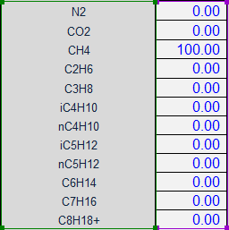
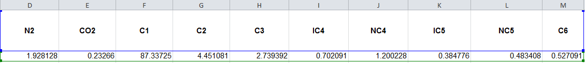

# Function-of-Ameripour-Hydrates-Model  
## The work of Sharareh Ameripour in "PREDICTION OF GAS-HYDRATE FORMATION CONDITIONS IN PRODUCTION AND SURFACE FACILITIES" is excellent. And is already in Excel!
So... Why I’m i in here adding more code?  
## I honestly cannot make an improvement of the theoretical, practical and statistical solution she proposed. But, i also believe that the user of Excel is looking for a robust, function focused solution. Instead of looking for changing a sub or uploading it's values in another sheet.  

The original Sharareh sheets are in a macro, not in a excel formula.  
So predicting a trending will be much harder with that approach.  
In here you will find the proposed equations, as a easy to use function.  
## How do you use the formula?  
=HydrateAmeripourS(TempInF,PressInPSI,LabelsOfComponents,ValuesOfComponents_MolPercentage)  
Were...  
TempInF = Temperature in Fahrenheit or 0 (zero) if you want to know the temperature.  
PressInPSI = Pressure in PSI or 0 (zero) if you want to know the pressure.  
LabelsOfComponents = Name of the components being uploaded.  
ValuesOfComponents_MolPercentage = mole percent of the components being uploaded.  
## how do you expect me to use the formula without an example?  
for example you can use =HydrateAmeripourS(32,0,$B$8:$B$19,$C$8:$C$19) if you wan't to know the pressure of hydrate formation at 32 °F.   
where the selected range can be something like this.  
  
  
or this.  
  
  
  
There is no specific order for the chromatography and several aliases of the components will be recognized.
you can find in more detail all the components aliases below.
The aliases **are not** case sensitive.
### Component: Hydrogen Sulfide  
### Aliases.  
  H2S  
  SH2  
  HYDROGEN SULFIDE  
### Component: Carbon Dioxide  
### Aliases.  
  CO2  
  CARBON DIOXIDE  
  CARBONIC ACID  
### Component: Nitrogen  
### Aliases.  
  N2  
  NITROGEN  
  N  
### Component: Methane  
### Aliases.  
  C1  
  CH4  
  METHANE  
### Component: Ethane  
### Aliases.  
  C2  
  C2H6  
  ETHANE  
### Component: Propane  
### Aliases.  
  C3  
  C3H8  
  PROPANE  
### Component: Isobutane  
### Aliases.  
  IC4  
  IC4H10  
  ISOBUTANE  
### Component: Butane  
### Aliases.  
  NC4  
  C4  
  NC4H10  
  NORMALBUTANE  
  NORMAL BUTANE  
  BUTANE  
### Component: Isopentane  
### Aliases.  
  IC5  
  IC5H12  
  ISOPENTANE  
### Component: Pentane  
### Aliases.  
  NC5  
  C5  
  NC5H12  
  NORMALPENTANE  
  NORMAL PENTANE  
  PENTANE  
### Component: Hexane  
### Aliases.  
  NC6  
  C6  
  C6H14  
  HEXANE  
### Component: Heptane  
### Aliases.  
  NC7  
  C7  
  C7H16  
  HEPTANE  
### Component: Octane  
### Aliases.  
  NC8  
  C8  
  C8H18  
  C8H18+  
  OCTANE  
### Component: Ethene  
### Aliases.  
  C2H4  
  ETHENE  
### Component: Propene  
### Aliases.  
  C3H6  
  PROPENE  
### Component: Sodium Chloride  
### Aliases.  
  NACL  
  SALT  
  SODIUM CHLORIDE  
### Component: Potassium Chloride  
### Aliases.  
  KCL  
  POTASSIUM CHLORIDE  
### Component: Calcium Chloride  
### Aliases.  
  CACL  
  CALCIUM CHLORIDE  
  CACL2  
### Component: Methanol  
### Aliases.  
  CH3OH  
  METHANOL  
### Component: Ethylene Glycol  
### Aliases.  
  EG  
  ETHYLENE GLYCOL  
### Component: Triethylene Glycol  
### Aliases.  
  TEG  
  TRIETHYLENE GLYCOL  
### Component: Glycol  
### Aliases.  
  GL  
  GLYCOL  
